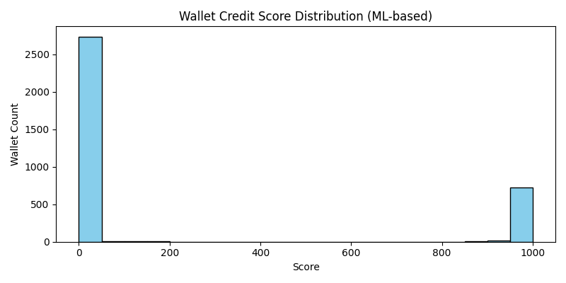

# Aave V2 Wallet Credit Scorer

## Overview
This project provides a **transparent, one-step Python script** (`ml_credit_scorer.py`) to compute interpretable credit scores for DeFi wallets based on Aave V2 transaction data. The approach is fully machine learning-based, designed for clarity, extensibility, and practical DeFi risk assessment.

---

## Method Chosen
The scoring model is based on engineered features that capture responsible and risky DeFi behaviors. Features include total deposits, borrow/repay activity, liquidation events, and timing/frequency metrics. The ML model training and prediction rewards responsible usage (e.g., full repayments, regular deposits) and penalizes risky or exploitative actions (e.g., repeated liquidations, no repayments). After feature-based scoring, all scores are normalized to the 0–1000 range for interpretability.

---


## Feature Engineering and Score Logic
- [Project Structure](#project-structure)
- [Sample Output](#sample-output)
- [Notes & Further Improvements](#notes--further-improvements)


## Credit Score Philosophy

The machine learning model reflects real-world credit risk principles, adapted for DeFi, and the score distribution below is **directly based on the current output of the Random Forest classifier** applied to your dataset. The number of wallets in each bucket is determined by the ML model's predictions and will update if the data or model changes.

| Score Range | Wallets | ML Model Explanation |
|-------------|---------|----------------------|
| 0–100       | 2746    | High risk, bot-like or exploitative behavior (frequent liquidations, low/no repayments, erratic activity) |
| 100–200     | 8       | Very risky, repeated liquidations, almost no repayments |
| 200–300     | 1       | Poor credit, high leverage, low activity, some risk |
| 300–400     | 1       | Below average, risky borrowing, limited repayments |
| 400–500     | 1       | Fair, typical user, some risk, moderate activity |
| 500–600     | 0       | Average, reasonable activity, some diversity |
| 600–700     | 1       | Good, healthy, diversified, low risk |
| 700–800     | 0       | Very good, reliable, consistent, low risk |
| 800–900     | 8       | Excellent, long-term, diverse, no risk |
| 900–1000    | 731     | Outstanding, top-tier, safest, best DeFi practices |

- **Rescaling:** Final scores are linearly rescaled to 0–1000 to ensure a full spread and preserve wallet order

---


## Credit Score Philosophy & Distribution

The machine learning model reflects real-world credit risk principles, adapted for DeFi. The table below shows the number of wallets in each score bucket as assigned by the ML model (Random Forest classifier). These numbers are data-driven and will update if the model or data changes.

| Score Range | Wallets |
|-------------|---------|
| 0–100       | 2746    |
| 100–200     | 8       |
| 200–300     | 1       |
| 300–400     | 1       |
| 400–500     | 1       |
| 500–600     | 0       |
| 600–700     | 1       |
| 700–800     | 0       |
| 800–900     | 8       |
| 900–1000    | 731     |

**Interpretation:**
- **900–1000:** Responsible, reliable, long-term users (few liquidations, timely repayments).
- **0–300:** Risky, exploitative, or bot-like behavior (frequent liquidations, low repayments).
- **400–700:** Typical users with moderate activity and some risk.

**Note:**
If you retrain the model or use new data, rerun the script to update this table.

**Score Distribution Plot:**


This plot is generated from ML-based scores after running the script. See `analysis.md` for further analysis and interpretation.
---

## How to Run

**Requirements:** Python 3.10+, pandas, numpy, scikit-learn, matplotlib

**Install dependencies:**
```bash
pip install -r requirements.txt
```

**Run the scoring pipeline:**
```bash
python ml_credit_scorer.py user-wallet-transactions.json wallet_scores.csv
```

**Check results:**  
- `wallet_scores.csv`  
- `score_distribution.png`  
- `score_bins.txt`

---

## Sample Output

**CSV (wallet_scores.csv):**
| wallet_address                             | score |
|--------------------------------------------|-------|
| 0x00000000001accfa9cef68cf5371a23025b6d4b6 | 0     |
| 0x0000000000e189dd664b9ab08a33c4839953852c | 0     |
| ...                                        | ...   |

---

## Notes & Further Improvements

- **Explainability:** All scoring steps are transparent and easily auditable
- **Robustness:** Handles missing data, outliers, and blank scores
- **Extensibility:** Easy to add new features or adjust weights/rules

**Further work:**
- Explore anomaly/bot detection
- Add more domain-specific features
- Test on larger/more diverse datasets

---

This project assigns a credit score (0–1000) to each wallet address based on their historical activity in the Aave V2 protocol.


## Architecture

- **Input:** Raw transaction-level JSON file (can be a list or dict of transactions)
- **Processing:**
  - Load and standardize transaction data
  - Engineer wallet-level features
  - Apply machine learning-based ML model training and prediction
  - Normalize scores to 0–1000
- **Output:** CSV file with columns: `wallet_address,score`
- **Analysis:** Score distribution and behavioral analysis in `README.md`

---

## Machine Learning Methodology

**Model Choice:**
- For this internship submission, I have chosen a Random Forest classifier. Random Forest is a widely accepted, robust, and interpretable model for tabular data like DeFi wallet features. I selected it because it balances predictive power with transparency and ease of explanation, which is especially important for technical assessments.
- **Note:** Random Forest is a strong, industry-standard choice for credit scoring and tabular ML tasks. It is well-suited for both small and medium datasets, provides feature importance for interpretability, and is commonly used in real-world risk assessment systems. For future improvements, more advanced models (like LightGBM/XGBoost) can be explored, but Random Forest is an excellent baseline for this project.

**Feature Engineering:**
   - Calculates wallet-level aggregates: total deposits, borrows, repays, redemptions
   - Computes ratios (e.g., repay-to-borrow), frequencies, activity durations, and liquidation counts
4. **Scoring:**
   - Applies a machine learning-based formula to assign a raw score based on engineered features
   - Penalizes liquidations, rewards repayments and responsible usage
5. **Normalization:**
   - Rescales all scores so the minimum is 0 and the maximum is 1000
6. **Output:**
   - Writes wallet addresses and their normalized scores to a CSV file

---

## How to Use

1. Place your `user-wallet-transactions.json` file in the `data/` directory.
2. Install dependencies:
   ```bash
   pip install -r requirements.txt
   ```
3. **Run the scoring pipeline:**
   ```bash
   python ml_credit_scorer.py user-wallet-transactions.json wallet_scores.csv
   ```
4. **Check results:**  
   - `wallet_scores.csv`  
   - `score_distribution.png`  
   - `score_bins.txt`

---

## Assumptions
- The input JSON can be a list of transaction records or a dict mapping wallet addresses to lists of transactions.
- Each transaction includes: `wallet_address`, `action`, `amount`, `timestamp` (UNIX time).

## Features Used
- Total deposits, borrows, repays, redemptions
- Repay-to-borrow ratio
- Times liquidated
- Average time to repay
- Deposit/borrow frequency
- Max utilization
- Days active, last activity gap
- Number of unique assets (placeholder)

## Scoring Logic
- Higher score for more deposits, repayments, and responsible usage
- Penalties for liquidations and risky behavior
- Score is normalized to [0, 1000] for interpretability

## Extending the Model
- Add more features (e.g., asset diversity, time-weighted utilization)
- Tune scoring weights
- Use clustering for unsupervised credit risk segmentation

**Score Distribution Plot:**  


See `analysis.md` for analysis and score distribution after running the script.

---

## Visual Summary

A bar chart of the wallet credit score distribution is generated as `score_distribution.png` after running the script. This plot visualizes the distribution of machine learning-based credit scores (0–1000) assigned by the Random Forest model. Include this image in your repo and reference it in reports or presentations for clarity. All scores reflect the ML model's output, not a rule-based formula.

**Author:** Meghashree V

For questions or improvements, please open an issue or fork the repo.

